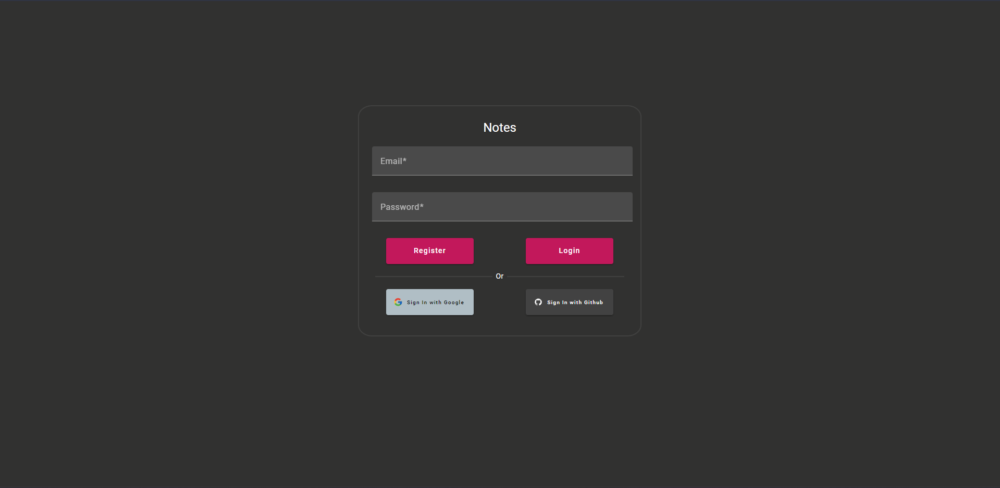
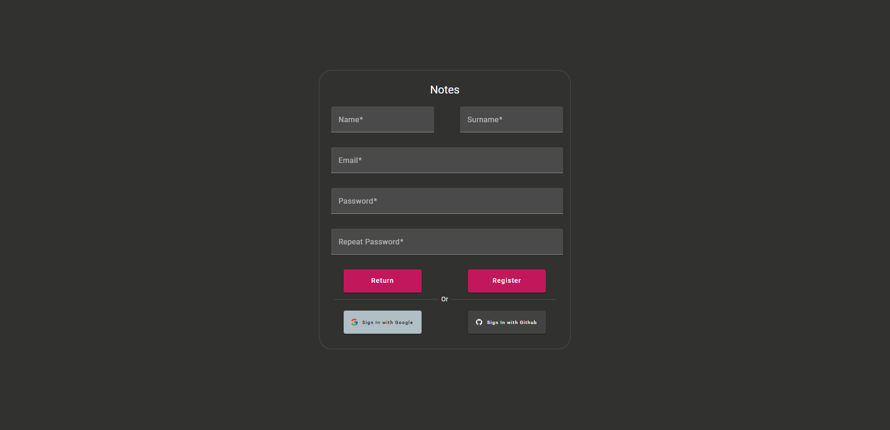
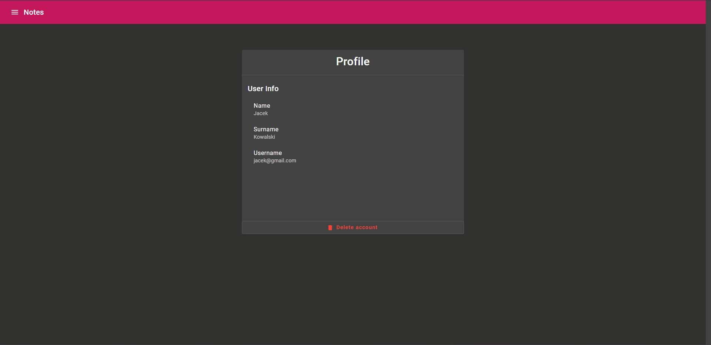
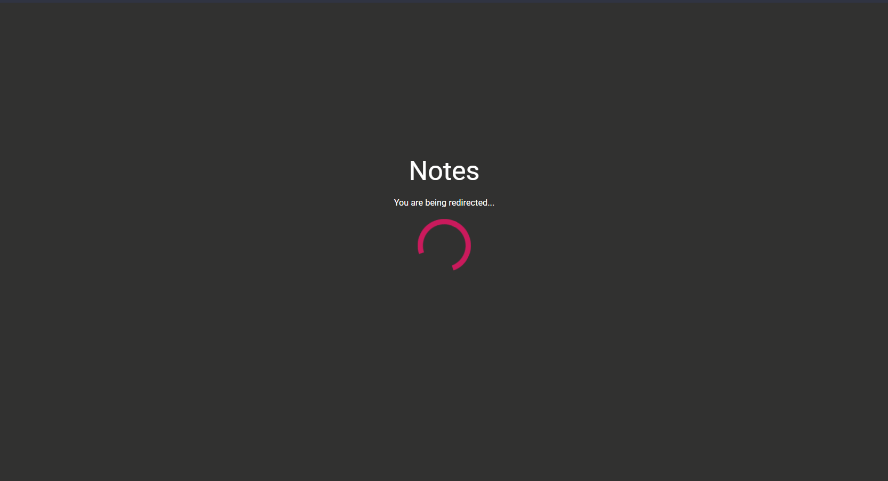
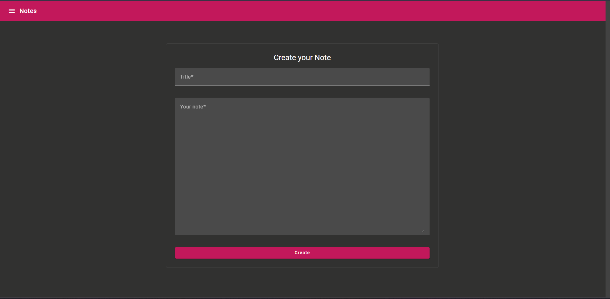
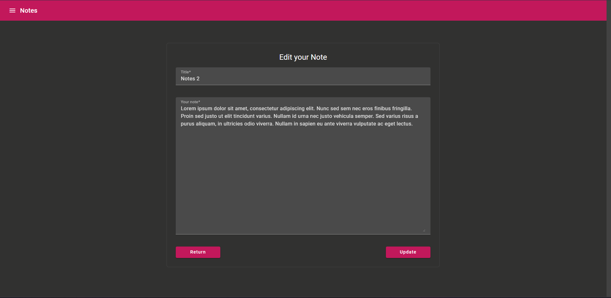
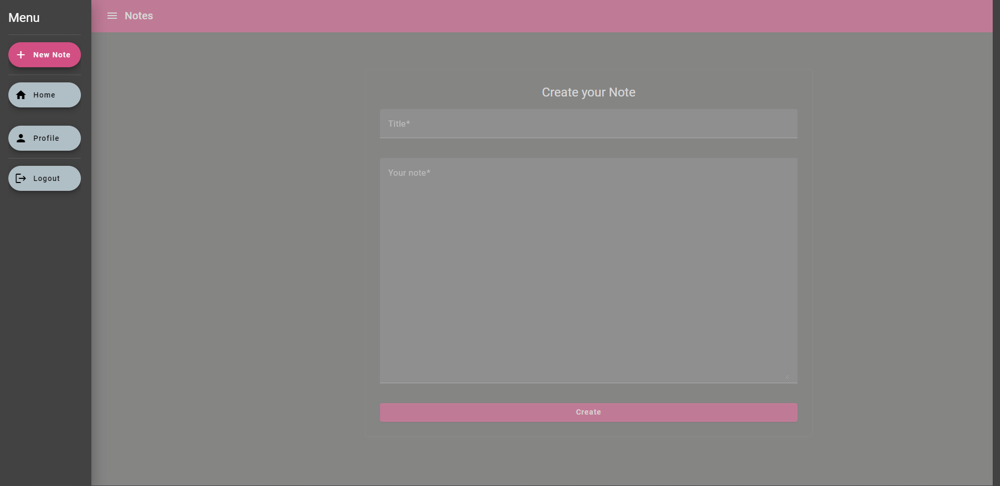
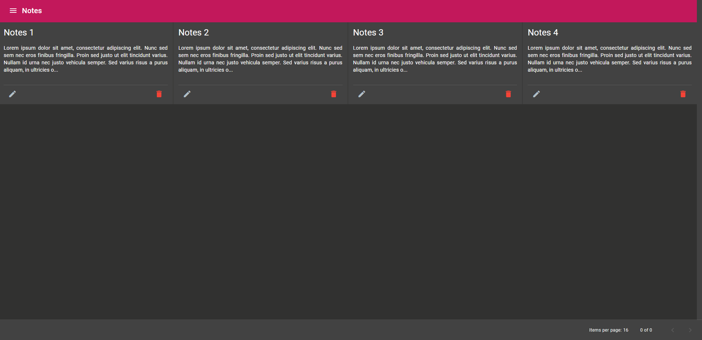
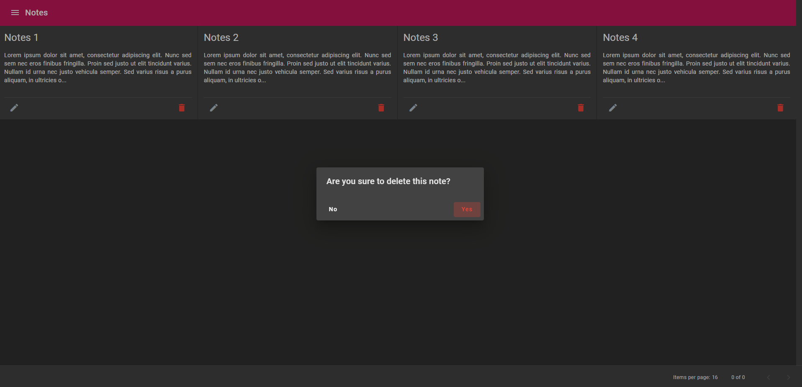

# NoteApp

Simple application for writing and managing notes.

## Technology stack

### Backend

* Spring Boot,
* Spring Data Jpa,
* Mapstruct,
* Jwt,
* Postgres Sql,,
* Docker,
* Junit 5,
* Mockito,
* Gradle

### Frontend

* Angular 16,
* Typescript 5,
* Scss,
* Html 5,
* Angular Material

## Frontend screenshots

### Login

    

### Register

    

### Profile

    

### OAuthLogin

    

### Create Note

    

### Edit Note

    

### Side Menu

    

### Notes

    

### DeleteNote

    

